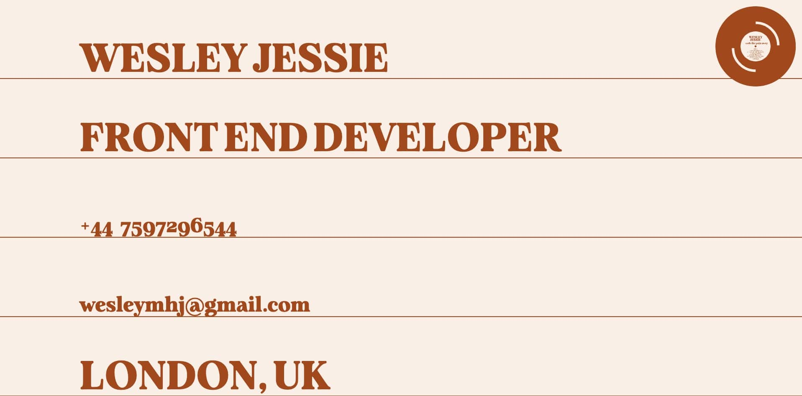

<h1 align="center" style="color:#AC521F">wesleyjessie.com</h1>

<p align="center">2023 version of wesleyjessie.com. </p>

<p align="center">Built with Next JS, Typescript, React Spring, and Tailwind.</p>



<h2> Getting Started</h2>
First, run the development server:

```bash
npm run dev
# or
yarn dev
# or
pnpm dev
```

Open [http://localhost:3000](http://localhost:3000) with your browser to see the result.
